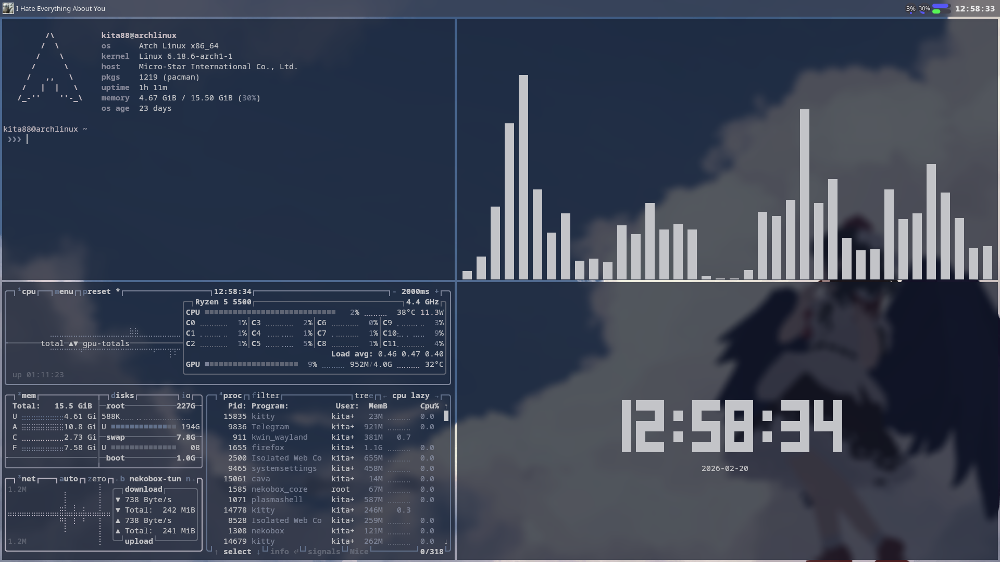
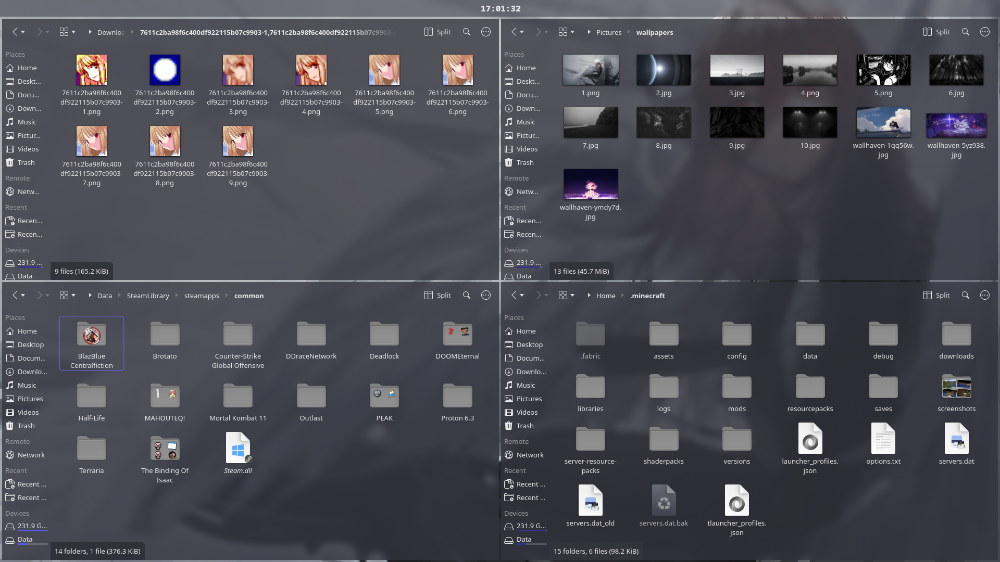
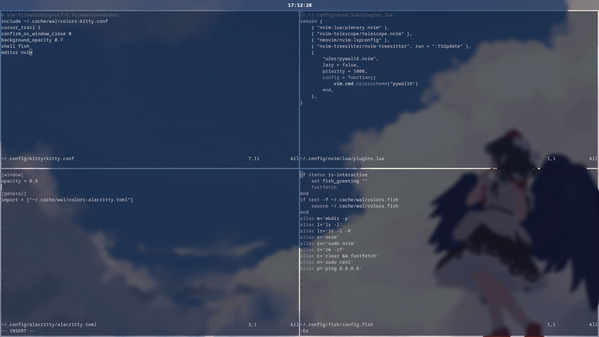

# Welcome!
I don't really like how kde plasma looks like. So it's my attempt to make it look beautiful!

# Screenshots

## Desktop


## Explorer


## Neovim


# Things I use

I don't recommend KWin tiling. It's really laggy and hard to use.

* OS: Arch
* Terminal: Kitty
* Colors: Pywal
* Shell: Fish
* Tiling: Polonium (KWin Script)
* File Manager: Dolphin
* Editor: Neovim
* Music: Spotify + Cava

# Configuration

I placed some configs in ```.config``` folder so you can use it if you want

## Global Theme

* Colors: Layan
* Application Style: Layan (Kvantum)
* Plasma Style: Layan
* Window Decorations: Layan
* Icons: WhiteSur Grey Dark
* Cursors: McMojave
* Splash Screen: Layan

## Shortcuts

Note: You can set up ```Polonium``` shortcuts in: ```Shortcuts/System Services/Window Management/Polonium```

### Applications

* Spectacle: Meta+X (Capture Rectangular Region)
* Dolphin: Meta+E (Launch)
* Kitty: Meta+Q (Launch)
* KRunner: Meta+W (Launch)
* System Settings: Meta+I (Launch)

### Window Management

* Close Windows: Meta+C
* Switch to Desktop 1: Meta+1
* Switch to Desktop 2: Meta+2
* Switch to Desktop 3: Meta+3

## Window Management

I use default settings almost everywhere, i only changed ```Better Blur DX``` to slightly less blur

### Desktop Effects

* Better Blur DX
* Translucency
* Sheet (Not Always)

### KWin

* Polonium (Main part of my config)

# Thank for visiting!
I hope atleast something of my config could be helpful for you.
